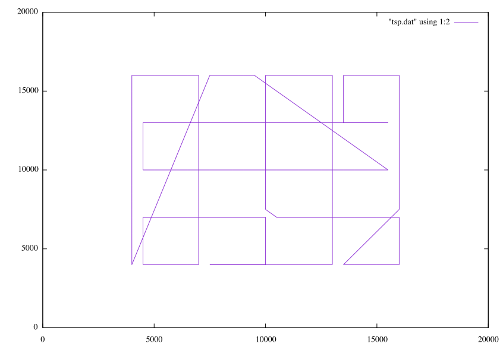
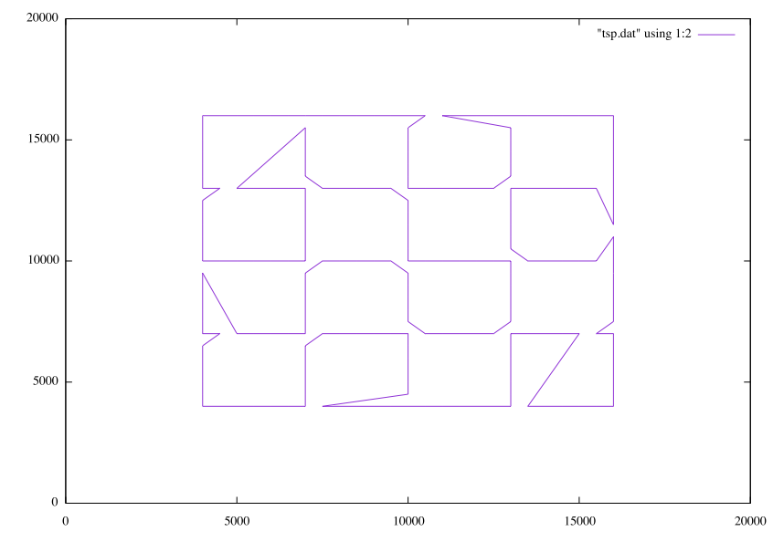

# TSP（Traveling Salesman Problem）

点データを読み込み，局所探索を用いてTSPの近似解を求め，gnuplotの描画用ファイルを出力します．
コマンドラインツール上には，解の改善に関するログを出力します．

入力：点データ  
出力：tsp.plot，tsp.plot

実行方法
```
g++ tsp3.cpp -o tsp -std=c++17
./tsp ../data/ts225.txt
```
gnuplotを利用できる環境であれば，以下を実行すれば描画できる．
```
gnuplot plot.dat
```
---
### 実行結果のサンプル
<p align="center">
  
  <br>
  <em>初期解</em>
</p>
<p align="center">
  
  <br>
  <em>解の改善を行った結果</em>
</p>
